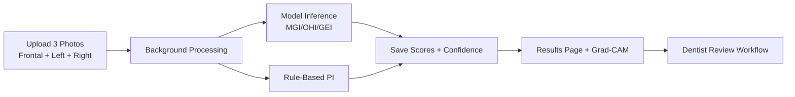
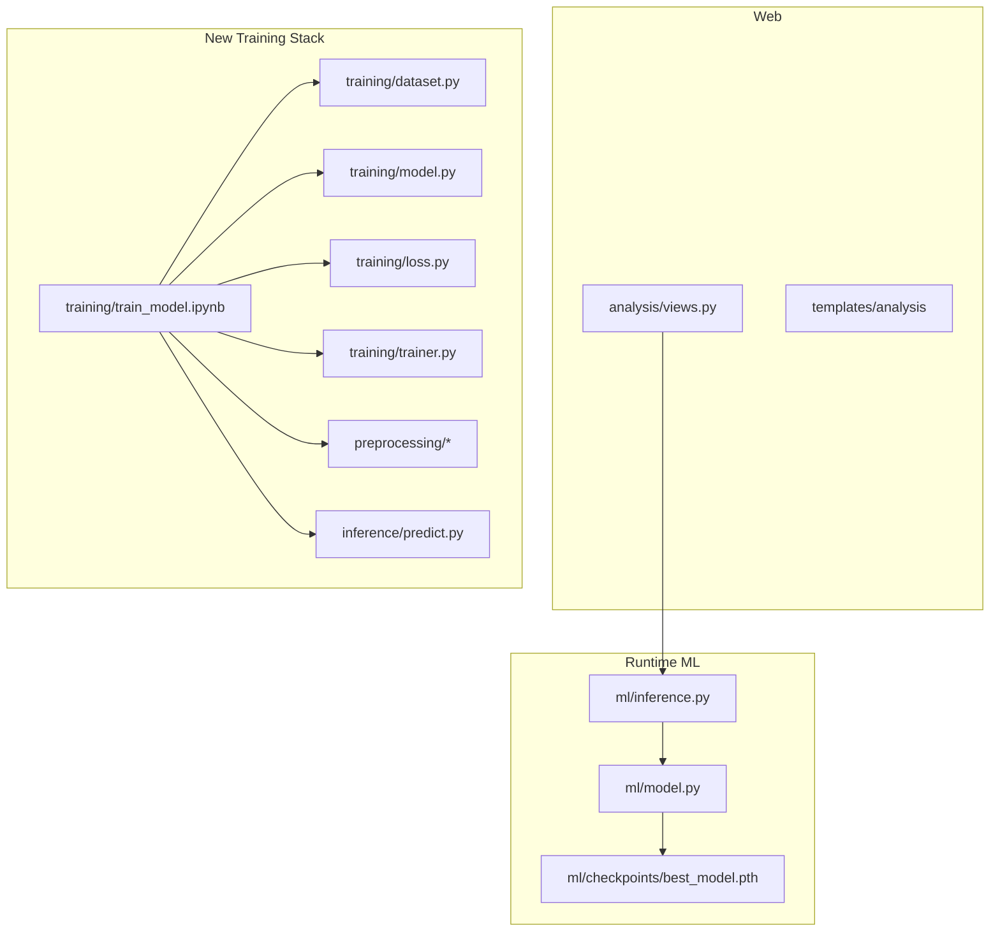

# DentAI Oral Health Prediction System


AI-assisted dental analysis platform that predicts oral health indices from three intraoral photos:

- MGI (Modified Gingival Index)
- OHI (Oral Hygiene Index)
- GEI (Gingival Enlargement Index)
- PI (Plaque Index, rule-based)

## System Flow



## Architecture Snapshot



## Active Model Policy

Current runtime uses one checkpoint only:

- Active model: [ml/checkpoints/best_model.pth](ml/checkpoints/best_model.pth)

All older fold and training artifact checkpoints were removed to keep the codebase clean until next training run.

## Quick Start

### 1) Environment

```powershell
Set-ExecutionPolicy -Scope Process Bypass
.\venv\Scripts\activate
pip install -r requirements.txt
pip install -r requirements_model.txt
```

### 2) Run App

```powershell
python manage.py migrate
python manage.py runserver 8000
```

Open: http://127.0.0.1:8000/

### 3) Train (GPU Required)

Use either notebook (both are kept):

- [ml/Train_Model.ipynb](ml/Train_Model.ipynb)
- [training/train_model.ipynb](training/train_model.ipynb)

The new training notebook enforces CUDA and stops immediately if GPU is unavailable.

## Data Contract

Primary label source:

- [Thesis_Data/Thesis_Results.csv](Thesis_Data/Thesis_Results.csv)

Image mapping convention:

- Frontal: F{Sl No}
- Left: L{Sl No}
- Right: R{Sl No}

Only complete triplets are used for training.

## Feature Matrix

| Capability | Status | Location |
|---|---|---|
| 3-view upload and async processing | Active | [analysis/views.py](analysis/views.py) |
| MGI/OHI/GEI inference | Active | [ml/inference.py](ml/inference.py) |
| PI persistence and display | Active | [analysis/models.py](analysis/models.py), [templates/analysis/results.html](templates/analysis/results.html) |
| Startup model warm-up | Active | [analysis/apps.py](analysis/apps.py) |
| New patch-based predictor module | Ready | [inference/predict.py](inference/predict.py) |
| New training pipeline modules | Ready | [training](training) |

## Interactive Ops Notes

<details>
<summary>Model Path Resolution</summary>

Runtime resolution order:

1. MODEL_PATH environment variable
2. settings MODEL_PATH
3. Fallback to [ml/checkpoints/best_model.pth](ml/checkpoints/best_model.pth)

Configured in [dental_project/settings.py](dental_project/settings.py) and used by [ml/inference.py](ml/inference.py).

</details>

<details>
<summary>GPU Validation Checklist</summary>

```powershell
nvidia-smi
python -c "import torch; print(torch.cuda.is_available(), torch.version.cuda)"
```

If CUDA is False, training notebook will fail fast by design.

</details>

<details>
<summary>Troubleshooting</summary>

- Model not loading:
  - Verify [ml/checkpoints/best_model.pth](ml/checkpoints/best_model.pth) exists.
- Slow inference:
  - Confirm warm-up is enabled in [dental_project/settings.py](dental_project/settings.py).
- Training OOM:
  - Reduce batch size in [training/train_model.ipynb](training/train_model.ipynb).

</details>

## Repository Layout

```text
analysis/         Django app (views, models, forms, templates)
dental_project/   Django project settings and routes
ml/               Current runtime model and inference path
preprocessing/    New image preprocessing stack (YOLO/SAM/patches)
training/         New modular training stack + notebook
inference/        New predictor + plaque algorithm
Thesis_Data/      Labels and photos dataset
```
